# Guide to Updating the TestifyNetwork Website

This guide walks you through everything you need to set up your computer to make changes to the TestifyNetwork website, using a tool called Claude Code. You don't need any prior experience with GitHub, terminals, or coding — every step below tells you exactly what to type and click.

> **Note:** This is a working draft. Some sections are flagged with ⚠️ where a detail is still missing or needs review.

---
## Overview
### Database tables

```mermaid
erDiagram
    Users ||--|| User_Private_Details : has
    Users ||--o{ User_Roles : holds
    Users ||--o{ Testimonies : submits
    Users ||--o{ Leader_Interviews : "is interviewed"
    Users ||--o{ Channel_Posts : authors
    Users ||--o{ Ministry_Updates : authors
    Users ||--o{ Member_Notes : writes
    Users ||--o{ Content_Flags : files
    Users ||--o{ User_Agreement_Acknowledgments : acknowledges
    Users ||--o{ Ministries : registers
    Users ||--o{ Ministries : proposes
    Users |o--o{ Ministries : "leads / represents"
    Users |o--o{ Ministries : "is contact for"
    Users ||--o| Admin : is

    Ministries ||--o{ User_Roles : scopes
    Ministries ||--o{ Testimonies : receives
    Ministries ||--o{ Leader_Interviews : hosts
    Ministries ||--|| Channels : has
    Ministries ||--o{ Ministry_Updates : publishes
    Ministries ||--o{ Ministry_Newsletters : syndicates
    Ministries ||--o{ Member_Notes : "is noted on"
    Ministries ||--o| Ministry_Questionnaire : uses

    Channels ||--o{ Channel_Posts : contains

    Member_Agreements ||--o{ User_Agreement_Acknowledgments : versions

    Admin ||--o{ Admin_Audit_Log : performs

    Users {
        uuid user_id PK
        text email UK
        text first_name
        text last_name
        text bio
        text home_church
        text ministry_interests "array"
        text profile_photo_url
        text referral_source "enum + freetext"
        text profile_visibility "private / staff_of_followed_ministries / dialogue_channels / all_members — multi-select, default private"
        text status "pending / onboarding / active / inactive"
        timestamptz created_at
        timestamptz updated_at
    }

    User_Private_Details {
        uuid user_id PK "FK, 1:1 with Users"
        text home_address
        text mobile_phone
        text spouse_name
        int birth_year "not exposed publicly"
    }

    Ministries {
        uuid ministry_id PK
        text name
        text slug UK
        text mission
        text hq_city
        text hq_state
        text hq_country
        text location_served "array"
        text people_groups_served "array"
        text ministry_type
        numeric annual_budget
        text ein
        text website_url
        text exec_director_name
        text irs_reports "array"
        text annual_reports "array"
        text form_990_source "public_filing / subsidiary_website / ministry_provided / not_available"
        bool subsidiary_status "operates as a subsidiary of a parent org"
        text subsidiary_irs_reports "array, nullable — filed under the parent org"
        text contact "point-of-contact name, captured pre-registration"
        text contact_role "staff / leader"
        uuid contact_id FK "nullable — linked once contact registers as a Member"
        text contact_role_details "freeform detail on contact_role"
        uuid leader_or_representative_user_id FK "nullable until claimed"
        uuid proposed_by FK
        uuid questionnaire FK "nullable, 1:1 with Ministry_Questionnaire"
        text nrm1 "nullable"
        text nrm2 "nullable"
        text status "20-value enrollment pipeline — see reference list below"
        int flag_level "0 none / 1 single / 2 double (auto-hidden)"
    }

    Ministry_Questionnaire {
        uuid questionnaire_id PK
        text NRM_1_review
        text question_1
        text question_2
        text question_3
        text question_4
        text question_5
        text question_6
        text question_7
    }

    User_Roles {
        uuid role_id PK
        uuid user_id FK
        uuid ministry_id FK "not null — every role is ministry-scoped"
        text role_on_testify "follow / witness / beneficiary / advocate / moderator / leader / representative"
        text role_in_ministry "optional: Leader / Staff / Volunteer / Donor / Beneficiary"
        timestamptz assigned_at
    }

    Testimonies {
        uuid testimony_id PK
        uuid ministry_id FK
        uuid user_id FK
        text type "text / video"
        text text_content
        text video_url
        text role_type "witness / beneficiary"
        bool is_advocate
        date service_date
        text sentiment "positive / neutral / negative"
        text status "pending / approved / removed"
        int flag_level "0 / 1 / 2"
    }

    Leader_Interviews {
        uuid interview_id PK
        uuid ministry_id FK
        uuid interviewed_user_id FK
        text type "text / video"
        text text_content
        text video_url
        timestamptz posted_at
        text status
        int flag_level "0 / 1 / 2"
    }

    Channels {
        uuid channel_id PK
        uuid ministry_id FK 
        timestamptz created_at
    }

    Channel_Posts {
        uuid post_id PK
        uuid channel_id FK
        uuid user_id FK "must hold a User_Roles row for this ministry"
        text content
        text image_url
        text file_attachment_url
        bool deleted_flag
        int flag_level "0 / 1 / 2"
    }

    Ministry_Updates {
        uuid update_id PK
        uuid ministry_id FK
        uuid posted_by_user_id FK
        text content
        text image_url
        timestamptz published_at
    }

    Member_Notes {
        uuid note_id PK
        uuid user_id FK
        uuid ministry_id FK
        text content
        timestamptz updated_at
    }

    Ministry_Newsletters {
        uuid newsletter_id PK
        uuid ministry_id FK
        text source_url
        text content
        timestamptz pulled_at
    }

    Content_Flags {
        uuid flag_id PK
        uuid flagged_by_user_id FK
        text target_type "post / testimony / profile / interview"
        uuid target_id "polymorphic, no DB-level FK"
        int severity "1 single-concern / 2 double-serious"
        text reason
        timestamptz resolved_at
        uuid resolved_by_user_id FK "no drawn edge"
    }

    Member_Agreements {
        uuid agreement_id PK
        text version
        text text_content
        date effective_date
    }

    User_Agreement_Acknowledgments {
        uuid ack_id PK
        uuid user_id FK
        uuid agreement_id FK
        timestamptz accepted_at
        text ip_address
    }

    Admin {
        uuid admin_id PK
        uuid user_id FK "1:1 with Users"
        timestamptz assigned_at
    }

    Admin_Audit_Log {
        uuid log_id PK
        uuid admin_id FK
        text action
        text target_type
        uuid target_id
        timestamptz timestamp
        text notes
    }

    Decline_Reasons {
        uuid reason_id PK
        text decline_stage "welcome / participation_guidelines / statement_of_faith"
        text opt_out_reason "optional, anonymous"
        timestamptz created_at
    }

    Incomplete_Enrollments {
        uuid record_id PK
        text enrollment_type "ministry"
        text exited_at_step "freetext step label"
        text opt_out_reason "optional, anonymous"
        timestamptz created_at
    }
```

#### Ministry Enrollment status pipeline
Ministries.status — the 20-step enrollment pipeline, in the order given.


**`waiting_generation_1`**

↓

**`correctly_identified`**

↓

**`relationship_identified`**

↓

**`contact_acquired`**

↓

**`invitation_sent`**

↓

**`invitation_accepted`**

↓

**`pending_admin_approval`**

↓

**`questionnaire_sent`**

↓

**`questionnaire_submitted`**

↓

**`questionnaire_pending_review`**

↓

**`questionnaire_completed`**

↓

**`NRM1_pending_review`**

↓

**`pending_both`**

↓

**`NRM1_reviewed`**

↓

**`NRM2_generated`**

↓

**`heart_questions_published`**

↓

**`NRM2_sent`**

↓

**`NRM2_pending_review`**

↓

**`NRM2_reviewed`**

↓

**`enrolled`**


## Part 1: Initial Computer Setup

These steps only need to be done once, when you're first setting up your computer.

### Step 1: Create an SSH key

An SSH key is like a digital ID card that lets your computer securely talk to GitHub without typing a password every time.

**On Mac:**
1. Open the app called **Terminal** (search for it using Spotlight: press `Cmd + Space`, type "Terminal", press Enter).
2. Type the following command and press Enter:
   ```
   ssh-keygen -t ed25519 -C "your_email@example.com"
   ```
   (Replace `your_email@example.com` with your actual email address.)
3. It will ask "Enter a file in which to save the key" — just press **Enter** to accept the default.
4. It will ask for a passphrase — press **Enter** (leave it blank), then press **Enter** again to confirm.

**On Windows:**
1. Open the app called **PowerShell** (search for it in the Start menu, type "PowerShell", press Enter).
2. Type the following command and press Enter:
   ```
   ssh-keygen -t ed25519 -C "your_email@example.com"
   ```
   (Replace `your_email@example.com` with your actual email address.)
3. It will ask "Enter a file in which to save the key" — just press **Enter** to accept the default.
4. It will ask for a passphrase — press **Enter** (leave it blank), then press **Enter** again to confirm.

---

### Step 2: Add your SSH key to GitHub

Now you'll give GitHub a copy of the "public" half of the key you just made, so it recognizes your computer.

**First, copy your public key:**

**On Mac:**
1. In Terminal, type the following command and press Enter — this copies your key to your clipboard:
   ```
   pbcopy < ~/.ssh/id_ed25519.pub
   ```

**On Windows:**
1. In PowerShell, type the following command and press Enter — this copies your key to your clipboard:
   ```
   Get-Content ~/.ssh/id_ed25519.pub | Set-Clipboard
   ```

**Then, add it to GitHub:**

1. Open a web browser and go to [github.com](https://github.com).
2. Log in to your account (or create one if you don't have one yet).
3. Click your profile picture in the top-right corner, then click **Settings**.
4. In the left sidebar, click **SSH and GPG keys**.
5. Click the green **New SSH key** button.
6. In the **Title** field, type something to identify this computer (e.g., "My Laptop").
7. In the **Key** field, paste the key you copied earlier (press `Cmd + V` on Mac or `Ctrl + V` on Windows).
8. Click the green **Add SSH key** button.
9. You may be asked to confirm your GitHub password — enter it if prompted.

---

### Step 3: Download (clone) the website project to your computer

"Cloning" means making a copy of the website's project files from GitHub onto your computer.

1. Open a web browser and go to:
   [https://github.com/TestifyNetwork/TestifyNetwork](https://github.com/TestifyNetwork/TestifyNetwork)
2. Click the green **Code** button.
3. In the menu that appears, click the **SSH** tab.
4. Click the small copy icon next to the address shown (it will look something like `git@github.com:TestifyNetwork/TestifyNetwork.git`). This copies it to your clipboard.

**Create a folder for the project:**

**On Mac:**
1. Open **Finder**.
2. Go to your **Documents** folder.
3. Right-click in an empty area, choose **New Folder**, and name it `TestifyNetwork`.

**On Windows:**
1. Open **File Explorer**.
2. Go to your **Documents** folder.
3. Right-click in an empty area, choose **New > Folder**, and name it `TestifyNetwork`.

**Enter that folder using the terminal:**

**On Mac (Terminal):**
```
cd ~/Documents/TestifyNetwork
```

**On Windows (PowerShell):**
```
cd ~\Documents\TestifyNetwork
```

**Clone the project:**

Type `git clone ` (with a space after it), then paste the address you copied earlier (`Cmd+V` on Mac, `Ctrl+V` on Windows), so it looks like this (yours will have the real address pasted in):

```
git clone git@github.com:TestifyNetwork/TestifyNetwork.git
```

Press Enter. You should see some text appear showing the files being downloaded.

---

### Step 4: Install the Supabase CLI

The Supabase CLI is a tool that lets you manage the website's database from the terminal.

**On Mac:**

1. First, check if you have **Homebrew** installed (a tool that helps install other tools). In Terminal, type:
   ```
   brew --version
   ```
   - If you see a version number, skip to step 2.
   - If you see "command not found," install Homebrew by typing:
     ```
     /bin/bash -c "$(curl -fsSL https://raw.githubusercontent.com/Homebrew/install/HEAD/install.sh)"
     ```
     Follow any on-screen instructions (you may be asked to enter your Mac password — this is normal, and nothing will appear on screen as you type it).

2. Install the Supabase CLI by typing:
   ```
   brew install supabase/tap/supabase
   ```

**On Windows:**

1. First, check if you have **Scoop** installed (a tool that helps install other tools). In PowerShell, type:
   ```
   scoop --version
   ```
   - If you see a version number, skip to step 2.
   - If you see an error, install Scoop by typing:
     ```
     irm get.scoop.sh | iex
     ```
     If you get a security error, type this first, press Enter, then try the command above again:
     ```
     Set-ExecutionPolicy RemoteSigned -Scope CurrentUser
     ```

2. Install the Supabase CLI by typing:
   ```
   scoop bucket add supabase https://github.com/supabase/scoop-bucket.git
   scoop install supabase
   ```

**Check it worked (Mac or Windows):**
```
supabase --version
```
You should see a version number printed.

---

### ⚠️ Step 5: Log in to Supabase — *possibly unnecessary, needs review*

> **Draft note:** this step may not be needed once project setup is included in the repo — confirm before finalizing.

1. Make sure you're in the right folder. In your terminal, type:

   **Mac:**
   ```
   cd TestifyNetwork/TestifyNetwork
   ```

   **Windows:**
   ```
   cd TestifyNetwork\TestifyNetwork
   ```

2. Log in to Supabase by typing:
   ```
   supabase login
   ```
3. This will open a web browser asking you to log in to Supabase (or create an account if you don't have one).
4. Once you log in, a window may ask you to confirm/authorize the CLI — click **Authorize**.
5. Return to your terminal — it should show you're logged in.

---

### Step 6: Link your project to Supabase

This connects the files on your computer to the correct online Supabase project (the database for the website).

In your terminal, type:
```
supabase link --project-ref fyngtvccgxbbyjvckdcf
```

⚠️ *You may be prompted to enter a database password — details on where to find this need to be added.*

---

### Step 7: Pull the database structure

This downloads the structure of the real (live) database — its tables and setup — so your local testing copy matches it.

1. Make sure you're in the project's `supabase` folder:

   **Mac:**
   ```
   cd ~/Documents/TestifyNetwork/TestifyNetwork/supabase
   ```

   **Windows:**
   ```
   cd ~\Documents\TestifyNetwork\TestifyNetwork\supabase
   ```

2. Run:
   ```
   supabase db pull
   ```
3. This downloads the database structure into your project files. You should see some output confirming it completed.

---

### Step 8: Download the `add_ministry` edge function

This downloads the code for a specific backend function called `add_ministry` so it's available in your local project.

1. Make sure you're still in the project's `supabase` folder:

   **Mac:**
   ```
   cd ~/Documents/TestifyNetwork/TestifyNetwork/supabase
   ```

   **Windows:**
   ```
   cd ~\Documents\TestifyNetwork\TestifyNetwork\supabase
   ```

2. Run:
   ```
   supabase functions download add_ministry
   ```
3. You should see a confirmation message once it finishes downloading.

---

### Step 9: Install Docker Desktop

Docker creates a safe, separate testing environment on your computer so you can try changes before they go live on the real website.

**On Mac:**
1. Go to [Docker Desktop for Mac](https://docs.docker.com/desktop/setup/install/mac-install/) and download Docker Desktop for Mac (choose **Apple silicon** if you have a newer Mac with an M1/M2/M3 chip, or **Intel chip** for an older Mac — if unsure, check the Apple menu > About This Mac).
2. Double-click the downloaded `Docker.dmg` file.
3. Drag the Docker icon into the **Applications** folder when prompted.
4. Open **Applications** and double-click **Docker** to start it.
5. You'll be shown a Subscription Service Agreement — click **Accept** (Docker is free for personal/non-commercial use).
6. Choose **Use recommended settings** when prompted, and enter your Mac password if asked.
7. Wait for Docker to finish starting (you'll see a whale icon in the menu bar at the top of your screen — it's ready when the whale stops animating).
8. **You do not need to create a Docker account.** If you're prompted to sign in, just click **Skip**.

**On Windows:**
1. Go to [Docker Desktop for Windows](https://docs.docker.com/desktop/setup/install/windows-install/) and download Docker Desktop for Windows.
2. Double-click `Docker Desktop Installer.exe`.
3. When asked to choose an installation mode, select **per-user installation** (recommended — no administrator password needed).
4. Follow the on-screen instructions to finish installing.
5. When installation finishes, click **Close**.
6. Search for "Docker Desktop" in the Start menu and open it.
7. You'll be shown a Subscription Service Agreement — click **Accept** (Docker is free for personal/non-commercial use).
8. Wait for Docker to finish starting (you'll see a whale icon in the system tray near the clock — it's ready when the whale stops animating).
9. **You do not need to create a Docker account.** If you're prompted to sign in, just click **Skip**.

> **Note:** On Windows, Docker requires a feature called **WSL 2**. Most modern Windows 10/11 computers already support this, and Docker will prompt you to enable it automatically if needed — just follow the on-screen instructions and restart your computer if asked.

---

### Step 10: Install Deno

Deno is a tool needed to run and test the website's backend functions locally.

**On Mac:**

Since you'll already have Homebrew installed from the Supabase CLI step, run this in Terminal:
```
brew install deno
```

**On Windows:**

In PowerShell, run:
```
irm https://deno.land/install.ps1 | iex
```

**Check it worked (Mac or Windows):**

Close your terminal window completely, then open a new one and type:
```
deno --version
```
You should see version numbers printed (for Deno, V8, and TypeScript). If you instead see "command not found," close and reopen your terminal again — this step often needs a fresh terminal window to work.

---

### Step 11: Start your local testing database

This spins up a local copy of the website's database inside Docker, so you can safely test changes before they affect the real (live) site.

1. Make sure **Docker Desktop is open and running** (you should see the whale icon fully loaded in your menu bar/system tray) — this step won't work unless Docker is running in the background.

2. In your terminal, navigate to the `supabase` folder inside the project:

   **Mac:**
   ```
   cd ~/Documents/TestifyNetwork/TestifyNetwork/supabase
   ```

   **Windows:**
   ```
   cd ~\Documents\TestifyNetwork\TestifyNetwork\supabase
   ```

3. Run the following command:
   ```
   supabase start
   ```

4. **You may be asked to enter your computer's password during this step.** This is normal and safe — go ahead and enter it (on Mac, nothing will appear on screen as you type, which is normal).

5. This may take a few minutes the first time, since it needs to download some files. You'll know it's done when you see a block of text in the terminal showing local URLs and keys (this means your local testing database is up and running).

> **Note:** Leave Docker Desktop running in the background while you're working — if you close it, your local testing database will stop working too.

**Understanding what you see and accessing your local database:**

After running `supabase start`, you'll see a block of text listing several local web addresses (for Studio, Mailpit, APIs, and so on). The important one for you is **Studio**.

**To view your local database:**
1. Copy this address: `http://127.0.0.1:54323`
2. Paste it into your web browser and press Enter.
3. This opens **Supabase Studio** — a visual tool where you can see and edit the website's data (tables, entries, etc.) in your local testing environment, separate from the live website.

> ⚠️ **Important note:** The keys and codes shown in your terminal (labeled things like "Publishable," "Secret," "Access Key," etc.) are unique to your project and act like passwords — don't share screenshots of this output with anyone, and don't paste these into anything other than where this guide tells you to.

---

### Step 12: Run the tests

This checks that everything is working correctly by running an automated test against the `add_ministry` function.

1. Navigate to the main project folder:

   **Mac:**
   ```
   cd ~/Documents/TestifyNetwork/TestifyNetwork
   ```

   **Windows:**
   ```
   cd ~\Documents\TestifyNetwork\TestifyNetwork
   ```

2. Run the test:
   ```
   deno test tests/add_ministry_test.ts 2>&1
   ```
3. You'll see output in the terminal telling you whether the test **passed** or **failed**. Look for a line near the bottom that says something like `ok` or `1 passed` (success), or `FAILED` (something went wrong).

---

### Step 13: Create the `.env.keys` file

Before running the regression test, you need to create a file with an API key.

1. Get the `PERPLEXITY_KEY` value from **project tracking**.

2. Navigate to the project's root folder:

   **Mac:**
   ```
   cd ~/Documents/TestifyNetwork/TestifyNetwork
   ```

   **Windows:**
   ```
   cd ~\Documents\TestifyNetwork\TestifyNetwork
   ```

3. Create the `.env.keys` file with the key inside it, replacing `your_key_here` with the key you copied:

   **Mac (Terminal):**
   ```
   touch .env.keys
   echo "PERPLEXITY_KEY=your_key_here" > .env.keys
   ```

   **Windows (PowerShell):**
   ```
   New-Item .env.keys -ItemType File
   Set-Content .env.keys "PERPLEXITY_KEY=your_key_here"
   ```

4. Double-check it worked:

   **Mac:**
   ```
   cat .env.keys
   ```

   **Windows:**
   ```
   Get-Content .env.keys
   ```

---

### Step 14: Deploy and test the function

This publishes your `add_ministry` function to the real, live Supabase project, then runs a test against it to confirm it's working.

1. Navigate to the main project folder:

   **Mac:**
   ```
   cd ~/Documents/TestifyNetwork/TestifyNetwork
   ```

   **Windows:**
   ```
   cd ~\Documents\TestifyNetwork\TestifyNetwork
   ```

2. Deploy the function:
   ```
   supabase functions deploy add_ministry
   ```
3. You should see a confirmation message once the deploy completes successfully.

4. Run the test against the deployed function:

   **Mac:**
   ```
   ./tests/add_ministry_regression.sh
   ```

   **Windows:** ⚠️ *(still needs a Windows equivalent for running `.sh` scripts — to be added)*
   ```
   [Windows equivalent needed]
   ```

5. You'll see output in the terminal telling you whether the test passed or failed.

6. You can also view the function's live logs and status any time by visiting:
   [https://supabase.com/dashboard/project/fyngtvccgxbbyjvckdcf/functions/add_ministry](https://supabase.com/dashboard/project/fyngtvccgxbbyjvckdcf/functions/add_ministry)

   This is useful for checking on the function after deploying, or for troubleshooting if something isn't working as expected.

> ⚠️ **Heads up:** step 2 publishes your changes to the live, real version of the function — not just your local testing copy. Make sure you're confident in your changes before running this.

---

## Part 2: Ongoing Workflow — Making Future Changes

The steps in Part 1 only need to happen once. The notes below describe the process to follow every time you make changes going forward.

### Committing your changes with Git

Whenever you make changes to the project files (like a new migration file), you need to "commit" them — this saves a snapshot of your changes and uploads them to GitHub so they're safely stored and shared.

1. Navigate to the main project folder:

   **Mac:**
   ```
   cd ~/Documents/TestifyNetwork/TestifyNetwork
   ```

   **Windows:**
   ```
   cd ~\Documents\TestifyNetwork\TestifyNetwork
   ```

2. Check what's changed:
   ```
   git status
   ```
   This lists any new or modified files, shown in red.

3. Stage your changes (tell Git which files to include in this commit):
   ```
   git add .
   ```
   The `.` means "include everything that's changed."

4. Commit your changes with a short description of what you did:
   ```
   git commit -m "Add migration for [describe your change here]"
   ```

5. Upload your commit to GitHub:
   ```
   git push
   ```

---

### Workflow: Changing the database schema

Follow this process any time you need to make a change to the database's structure (adding a new table, column, etc.):

1. Make your schema change (e.g., in Supabase Studio — ⚠️ *specifics on how changes are actually made still need to be added*).
2. Generate a migration file that records the change:
   ```
   supabase db diff
   ```
   This creates a new file inside the `supabase/migrations` folder in your project, named with a timestamp (e.g., `20260706120000_your_change.sql`). This file is a record of exactly what changed.
3. Commit the migration file using the **Committing your changes with Git** steps above.
4. Apply the change to the live, production database:
   ```
   supabase db push
   ```

---

### Workflow: Syncing changes made in Figma Make

Figma Make can make its own changes to the project. Since these changes come in outside of your normal workflow, follow these steps carefully to make sure nothing you're working on gets lost.

1. Save your current work first, using the **Committing your changes with Git** steps above:
   ```
   git add .
   git commit -m "Describe your changes here"
   git push
   ```

2. In Figma Make, push its changes to GitHub (using Figma Make's own interface/controls for this).

3. Fetch any database changes Figma Make made:
   ```
   supabase migration fetch --linked
   ```

4. Pull Figma Make's changes into your project:
   ```
   git pull
   ```

5. **Carefully review the output of `git pull`.** Figma Make's changes may have overwritten (reverted) some of your own recent changes to certain files — check the list of updated files closely.

6. View your recent commit history to find your own most recent commit (the one you made in step 1, right before Figma Make's changes came in):
   ```
   git log --oneline
   ```
   This shows a short list of recent commits with their commit hashes (a short code like `a1b2c3d`) next to a short description. Find the commit from step 1 and copy its hash.

7. For any file(s) you noticed in step 5 that had your changes overwritten, restore your version of that file using:
   ```
   git checkout <commit hash> -- <file path>
   ```
   Replace `<commit hash>` with the hash you copied in step 6, and `<file path>` with the file you want to restore (e.g., `supabase/functions/add_ministry/index.ts`). You can repeat this command for each affected file.

> ⚠️ **Note:** Step 7 requires judgment — carefully compare what Figma Make changed versus what you changed, so you don't accidentally undo work you actually want to keep from Figma Make. If you're ever unsure, it's worth pausing and asking for a second opinion before overwriting anything.

---

## Open Items / Flags for Review

- **Step 5 (Log in to Supabase):** may be removable — confirm whether it's still needed.
- **Step 6:** confirm whether a database password prompt happens, and where to find that password if so.
- **Step 14:** needs a Windows equivalent for running the `./tests/add_ministry_regression.sh` script (e.g., via Git Bash, or a `.ps1`/`.bat` equivalent).
- **Workflow: Changing the database schema, step 1:** needs specifics on *how* schema changes are actually made (e.g., directly in Supabase Studio's table editor?).
  